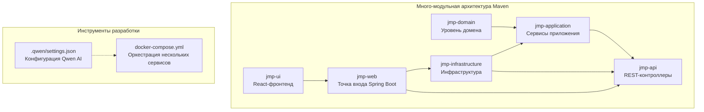
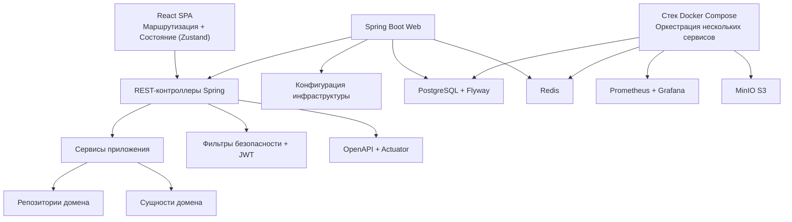
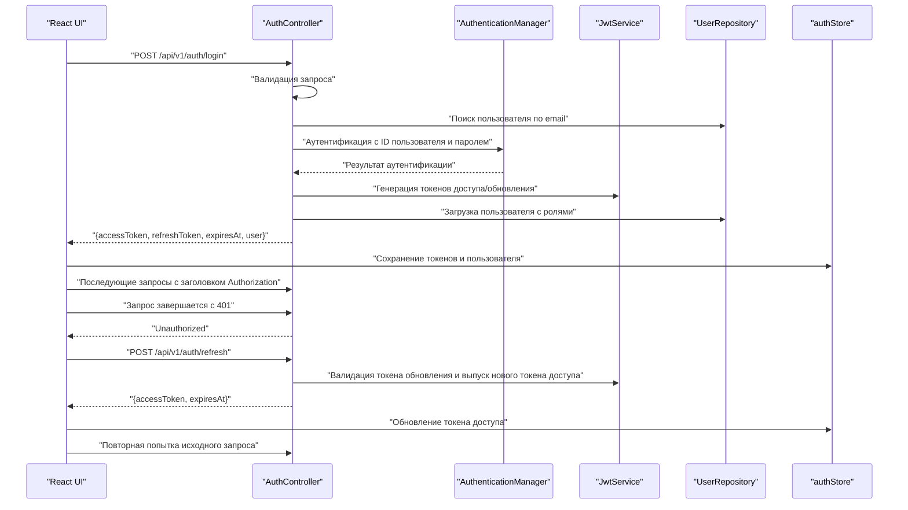
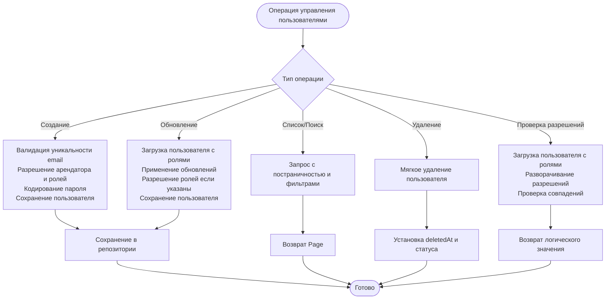
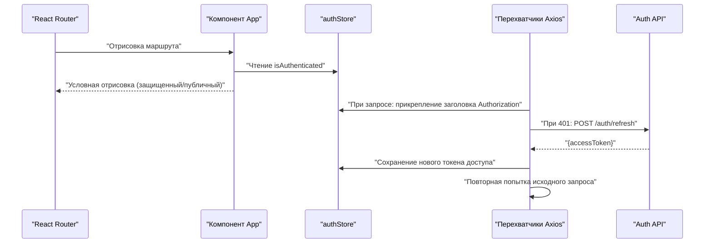
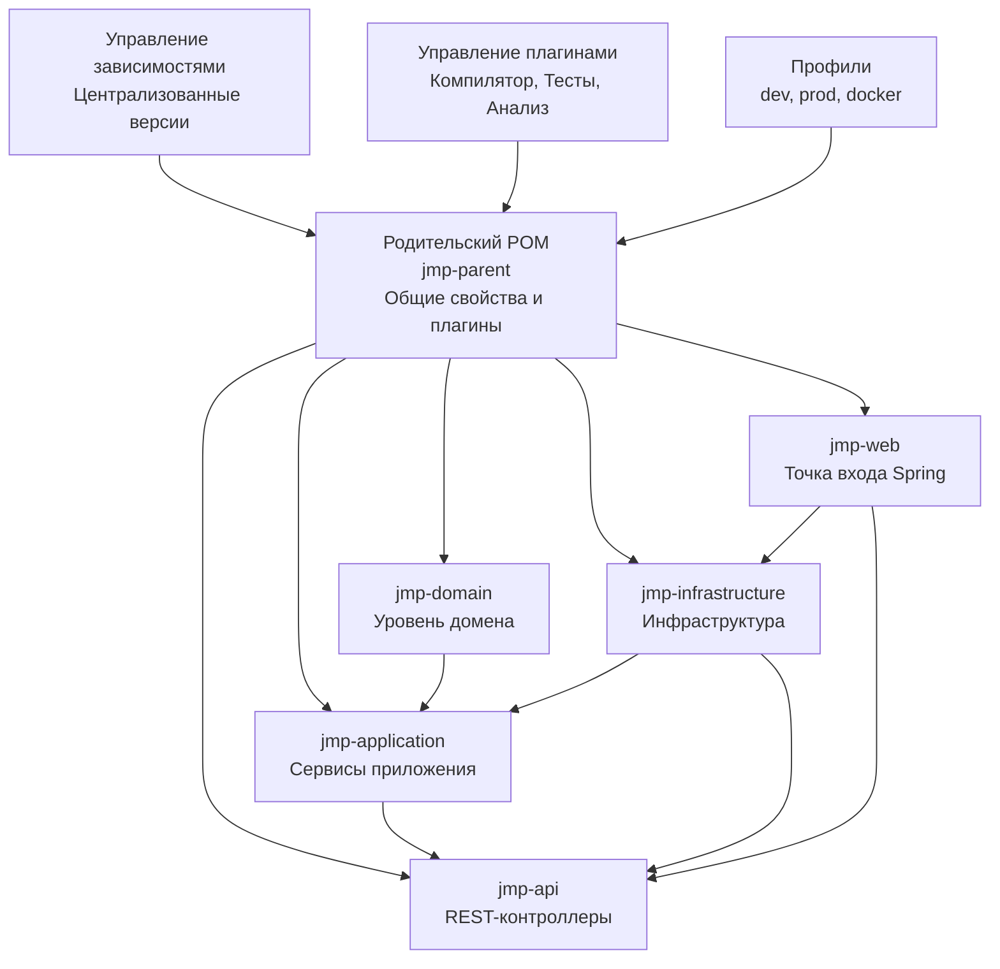

# Руководства по разработке

<cite>
**Файлы, упомянутые в этом документе**
- [pom.xml](file://pom.xml)
- [AuthController.java](file://jmp-api/src/main/java/com/jmp/api/controller/AuthController.java)
- [UserService.java](file://jmp-application/src/main/java/com/jmp/application/service/UserService.java)
- [User.java](file://jmp-domain/src/main/java/com/jmp/domain/entity/User.java)
- [SecurityConfig.java](file://jmp-infrastructure/src/main/java/com/jmp/infrastructure/security/SecurityConfig.java)
- [application.yml](file://jmp-web/src/main/resources/application.yml)
- [docker-compose.yml](file://docker-compose.yml)
- [App.tsx](file://jmp-ui/src/App.tsx)
- [authStore.ts](file://jmp-ui/src/store/authStore.ts)
- [api.ts](file://jmp-ui/src/services/api.ts)
- [package.json](file://jmp-ui/package.json)
- [tsconfig.json](file://jmp-ui/tsconfig.json)
- [eslint.config.js](file://jmp-ui/eslint.config.js)
- [vite.config.ts](file://jmp-ui/vite.config.ts)
- [JmpApplication.java](file://jmp-web/src/main/java/com/jmp/web/JmpApplication.java)
- [settings.json](file://.qwen/settings.json)
</cite>

## Сводка обновлений
**Внесенные изменения**
- Обновлено руководство по много-модульной архитектуре Maven с учетом установленной модульной структуры
- Добавлена документация по настройке конфигурации Qwen AI для инструментов разработки
- Расширена настройка среды разработки с комплексной оркестрацией нескольких сервисов
- Обновлена документация по управлению зависимостями и конфигурации сборки
- Расширено руководство по устранению неполадок с учетом много-модульной сборки и развертывания

## Содержание
1. [Введение](#введение)
2. [Структура проекта](#структура-проекта)
3. [Основные компоненты](#основные-компоненты)
4. [Обзор архитектуры](#обзор-архитектуры)
5. [Детальный анализ компонентов](#детальный-анализ-компонентов)
6. [Анализ зависимостей](#анализ-зависимостей)
7. [Вопросы производительности](#вопросы-производительности)
8. [Руководство по устранению неполадок](#руководство-по-устранению-неполадок)
9. [Заключение](#заключение)
10. [Приложения](#приложения)

## Введение
Этот документ содержит комплексные руководства по разработке для платформы управления Jitsi (JMP). Он охватывает стандарты кодирования на Java и TypeScript/JavaScript, сборку Maven и управление зависимостями, практики разработки на React, рабочий процесс Git, процессы проверки и качества кода, настройку среды разработки, подходы к отладке, рабочие процессы внесения вклада и рекомендации по безопасности/производительности. Платформа теперь имеет зрелую много-модульную архитектуру Maven с выделенными модулями для логики домена, сервисов приложения, инфраструктуры, контроллеров API и веб-конфигурации, а также комплексные инструменты разработки, включая интеграцию Qwen AI.

## Структура проекта
JMP использует сложную много-модульную структуру Maven с четким разделением ответственности между пятью отдельными модулями:
- Домен: Сущности, объекты-значения, репозитории и события домена
- Приложение: Сценарии использования, сервисы, DTO и логика маппинга
- Инфраструктура: Безопасность, постоянство, обмен сообщениями, кэширование и веб-конфигурация
- API: REST-контроллеры и вебхуки
- Веб: Точка входа Spring Boot и конфигурация среды выполнения
- UI: React-приложение с инструментарием Vite

**Источники диаграммы**
- [pom.xml:40-46](file://pom.xml#L40-L46)
- [docker-compose.yml:4-129](file://docker-compose.yml#L4-L129)
- [settings.json:1-9](file://.qwen/settings.json#L1-L9)

**Источники раздела**
- [pom.xml:40-46](file://pom.xml#L40-L46)
- [docker-compose.yml:4-129](file://docker-compose.yml#L4-L129)
- [settings.json:1-9](file://.qwen/settings.json#L1-L9)

## Основные компоненты
- Стандарты кодирования Java
  - Соглашения об именовании: PascalCase для классов/интерфейсов, camelCase для методов и полей, UPPER_SNAKE_CASE для констант; имена пакетов в нижнем регистре.
  - Аннотации: Предпочтительны аннотации Lombok (@RequiredArgsConstructor, @Slf4j) для уменьшения шаблонного кода; используйте аннотации Jakarta EE для валидации DTO; аннотируйте контроллеры с помощью Swagger @Tag/@Operation.
  - Логирование: Используйте SLF4J через @Slf4j; включайте контекстную информацию (например, идентификаторы пользователей) в логи; избегайте логирования конфиденциальных данных.
  - Исключения: Выбрасывайте соответствующие домену исключения; контроллеры должны предоставлять понятные сообщения; избегайте общих блоков catch-all.
  - Транзакции: Используйте @Transactional на границах сервисов; помечайте операции только для чтения соответствующим образом.
  - DTO и Мапперы: Используйте MapStruct с моделью компонента Spring; применяйте политику ошибок для неназначенных целевых полей, чтобы предотвратить тихую потерю данных.
  - Валидация: Используйте ограничения Bean Validation для DTO; валидируйте данные на границе API.
  - Безопасность: Аутентификация на основе stateless JWT; кодировщик BCrypt с настроенной стоимостью; CORS настроен для каждого окружения.
  - Конфигурация: Выносите секреты и специфичные для окружения настройки во внешние источники; используйте профили Spring; включайте миграции Flyway; настраивайте Actuator и OpenAPI.

- Стандарты кодирования TypeScript/JavaScript
  - Соглашения об именовании: PascalCase для компонентов, camelCase для хуков/функций, UPPER_SNAKE_CASE для констант; храните файлы модульно в src/components, src/pages, src/services, src/store, src/types.
  - React: Функциональные компоненты с хуками; строгая типизация с TypeScript; централизованный API-клиент с перехватчиками для аутентификации и обновления токенов.
  - Управление состоянием: Zustand для легковесного локального состояния; сохраняемое хранилище для токенов аутентификации и профиля пользователя.
  - Инструментарий: Плоская конфигурация ESLint с рекомендуемыми правилами TypeScript и React hooks; Vite для быстрой сборки/разработки; Material UI для компонентов.

- Инструментарий разработки Qwen AI
  - Конфигурация: Настройки Qwen AI позволяют использовать команды Docker Compose для упрощения рабочих процессов разработки.
  - Разрешения: Явно настроенные разрешения Bash для операций docker-compose.
  - Интеграция: Бесшовная интеграция со средой разработки для автоматизированных задач.

**Источники раздела**
- [AuthController.java:26-35](file://jmp-api/src/main/java/com/jmp/api/controller/AuthController.java#L26-L35)
- [UserService.java:24-32](file://jmp-application/src/main/java/com/jmp/application/service/UserService.java#L24-L32)
- [User.java:18-28](file://jmp-domain/src/main/java/com/jmp/domain/entity/User.java#L18-L28)
- [SecurityConfig.java:24-31](file://jmp-infrastructure/src/main/java/com/jmp/infrastructure/security/SecurityConfig.java#L24-L31)
- [application.yml:12-128](file://jmp-web/src/main/resources/application.yml#L12-L128)
- [App.tsx:10-34](file://jmp-ui/src/App.tsx#L10-L34)
- [authStore.ts:13-47](file://jmp-ui/src/store/authStore.ts#L13-L47)
- [api.ts:13-58](file://jmp-ui/src/services/api.ts#L13-L58)
- [package.json:6-11](file://jmp-ui/package.json#L6-L11)
- [eslint.config.js:8-23](file://jmp-ui/eslint.config.js#L8-L23)
- [vite.config.ts:1-8](file://jmp-ui/vite.config.ts#L1-L8)
- [settings.json:1-9](file://.qwen/settings.json#L1-L9)

## Обзор архитектуры
JMP использует многоуровневую архитектуру с надежной много-модульной структурой Maven:
- Представление: React SPA (jmp-ui) с маршрутизацией и управлением состоянием
- API: REST-контроллеры (jmp-api), предоставляющие функции домена
- Приложение: Сервисы, оркестрирующие сценарии использования и маппинг DTO
- Домен: Сущности и репозитории, инкапсулирующие бизнес-логику
- Инфраструктура: Безопасность, постоянство, кэширование, обмен сообщениями и веб-конфигурация

**Источники диаграммы**
- [App.tsx:10-34](file://jmp-ui/src/App.tsx#L10-L34)
- [AuthController.java:30-35](file://jmp-api/src/main/java/com/jmp/api/controller/AuthController.java#L30-L35)
- [UserService.java:28-32](file://jmp-application/src/main/java/com/jmp/application/service/UserService.java#L28-L32)
- [User.java:23-28](file://jmp-domain/src/main/java/com/jmp/domain/entity/User.java#L23-L28)
- [SecurityConfig.java:42-61](file://jmp-infrastructure/src/main/java/com/jmp/infrastructure/security/SecurityConfig.java#L42-L61)
- [application.yml:12-128](file://jmp-web/src/main/resources/application.yml#L12-L128)
- [docker-compose.yml:4-129](file://docker-compose.yml#L4-L129)

## Детальный анализ компонентов

### Поток аутентификации (Java + React)
Эта последовательность иллюстрирует вход, выпуск токенов и автоматическое обновление на фронтенде.

**Источники диаграммы**
- [AuthController.java:42-100](file://jmp-api/src/main/java/com/jmp/api/controller/AuthController.java#L42-L100)
- [UserService.java:150-156](file://jmp-application/src/main/java/com/jmp/application/service/UserService.java#L150-L156)
- [SecurityConfig.java:69-75](file://jmp-infrastructure/src/main/java/com/jmp/infrastructure/security/SecurityConfig.java#L69-L75)
- [authStore.ts:23-46](file://jmp-ui/src/store/authStore.ts#L23-L46)
- [api.ts:25-58](file://jmp-ui/src/services/api.ts#L25-L58)

**Источники раздела**
- [AuthController.java:42-100](file://jmp-api/src/main/java/com/jmp/api/controller/AuthController.java#L42-L100)
- [UserService.java:150-156](file://jmp-application/src/main/java/com/jmp/application/service/UserService.java#L150-L156)
- [SecurityConfig.java:69-75](file://jmp-infrastructure/src/main/java/com/jmp/infrastructure/security/SecurityConfig.java#L69-L75)
- [authStore.ts:23-46](file://jmp-ui/src/store/authStore.ts#L23-L46)
- [api.ts:25-58](file://jmp-ui/src/services/api.ts#L25-L58)

### Сервис управления пользователями (Сложность и паттерны)
Сервис демонстрирует транзакционные границы, разрешение ролей и постраничные запросы.

**Источники диаграммы**
- [UserService.java:44-190](file://jmp-application/src/main/java/com/jmp/application/service/UserService.java#L44-L190)

**Источники раздела**
- [UserService.java:44-190](file://jmp-application/src/main/java/com/jmp/application/service/UserService.java#L44-L190)

### Компонент React и управление состоянием
UI использует центральный маршрутизатор и сохраняемое хранилище Zustand для состояния аутентификации. Перехватчики Axios обрабатывают инъекцию и обновление токенов.

**Источники диаграммы**
- [App.tsx:10-31](file://jmp-ui/src/App.tsx#L10-L31)
- [authStore.ts:23-46](file://jmp-ui/src/store/authStore.ts#L23-L46)
- [api.ts:13-58](file://jmp-ui/src/services/api.ts#L13-L58)

**Источники раздела**
- [App.tsx:10-31](file://jmp-ui/src/App.tsx#L10-L31)
- [authStore.ts:23-46](file://jmp-ui/src/store/authStore.ts#L23-L46)
- [api.ts:13-58](file://jmp-ui/src/services/api.ts#L13-L58)

## Анализ зависимостей
Много-модульная структура Maven обеспечивает четкие отношения зависимостей и централизованное управление:

- Координаты родительского POM определяют структуру сборки с общими версиями и управлением плагинами
- Зависимости модулей следуют паттерну многоуровневой архитектуры с правильными границами импорта/экспорта
- Управление зависимостями централизует версии для Spring Boot, Hibernate, Flyway, MapStruct, JWT, устойчивости и библиотек тестирования
- Плагины включают компилятор, Surefire/Failsafe, JaCoCo, SpotBugs и Checkstyle с комплексным покрытием
- Профили активируют настройки dev/prod с конфигурациями для конкретных окружений

**Источники диаграммы**
- [pom.xml:40-46](file://pom.xml#L40-L46)
- [pom.xml:79-167](file://pom.xml#L79-L167)
- [pom.xml:201-312](file://pom.xml#L201-L312)

**Источники раздела**
- [pom.xml:40-46](file://pom.xml#L40-L46)
- [pom.xml:79-167](file://pom.xml#L79-L167)
- [pom.xml:201-312](file://pom.xml#L201-L312)

## Вопросы производительности
- Backend
  - Используйте постраничность для перечисления/поиска; обеспечьте правильное индексирование для запросов с учетом арендатора.
  - Применяйте пакетные настройки и упорядоченные вставки/обновления для уменьшения количества обращений.
  - Включите сжатие и настройте размеры пула HikariCP для подключений к базе данных.
  - Используйте Redis для ограничения частоты и кэширования часто используемых данных; настройте таймауты соответствующим образом.
  - Мониторьте с помощью Micrometer и Prometheus; предоставляйте только необходимые эндпоинты Actuator.
- Frontend
  - Лениво загружайте тяжелые маршруты и компоненты; минимизируйте повторные рендеры с помощью мемоизации.
  - Используйте debounce для полей поиска; избегайте ненужных опросов.
  - Сохраняйте состояние аутентификации в localStorage/sessionStorage через сохраняемость Zustand.
- Производительность много-модульной сборки
  - Используйте возможности параллельной сборки Maven для модулей.
  - Применяйте плагин слоев Spring Boot для оптимизированных сборок контейнеров.
  - Реализуйте выборочную компиляцию модулей во время разработки.

## Руководство по устранению неполадок
- Ошибки сборки
  - Убедитесь, что версия Java соответствует свойствам проекта (Java 21); убедитесь, что обертка Maven доступна.
  - Запустите тесты с Surefire/Failsafe; проверьте пороги покрытия JaCoCo.
  - Статический анализ: отчеты SpotBugs и Checkstyle указывают на нарушения.
  - Много-модульные сборки: используйте `mvn clean install -pl <module> -am` для целевых сборок.
- Проблемы среды выполнения
  - Проверьте application.yml для источника данных, Redis и секретов JWT; подтвердите применение миграций Flyway.
  - Проверяйте логи в формате структурированного JSON; фильтруйте по идентификаторам трассировки для корреляции.
  - Подтвердите источники CORS и политику сессий в SecurityConfig.
  - Docker Compose: убедитесь, что все сервисы работоспособны и сетевое подключение функционирует.
- Фронтенд
  - Убедитесь, что VITE_API_URL указывает на backend; убедитесь, что перехватчики прикрепляют заголовки Authorization.
  - При 401 подтвердите доступность эндпоинта обновления и сохраняемость токенов.
- Интеграция Qwen AI
  - Проверьте разрешения настроек Qwen для операций Docker.
  - Проверьте разрешения команд Bash в settings.json.
  - Убедитесь в совместимости инструментов разработки с локальным окружением.

**Источники раздела**
- [pom.xml:48-77](file://pom.xml#L48-L77)
- [pom.xml:267-312](file://pom.xml#L267-L312)
- [application.yml:12-128](file://jmp-web/src/main/resources/application.yml#L12-L128)
- [SecurityConfig.java:42-89](file://jmp-infrastructure/src/main/java/com/jmp/infrastructure/security/SecurityConfig.java#L42-L89)
- [api.ts:13-58](file://jmp-ui/src/services/api.ts#L13-L58)
- [settings.json:1-9](file://.qwen/settings.json#L1-L9)

## Заключение
Эти руководства создают комплексную основу для разработки платформы управления Jitsi с ее зрелой много-модульной архитектурой Maven. Соблюдая изложенные стандарты, используя установленную модульную структуру, интегрируя инструменты разработки Qwen AI и следуя лучшим практикам React, участники могут создавать безопасные, производительные и поддерживаемые функции, сохраняя при этом четкое разделение ответственности между слоями. Сочетание надежной backend-архитектуры, современной frontend-разработки и комплексных инструментов разработки создает эффективную среду разработки для сложных требований платформы.

## Приложения

### A. Сборка Maven и управление зависимостями
- Жизненный цикл сборки
  - Компиляция, тестирование, проверка, упаковка; Surefire/Failsafe для модульных/интеграционных тестов; JaCoCo для проверки покрытия.
  - Много-модульные сборки поддерживают параллельное выполнение и выборочную компиляцию.
- Управление зависимостями
  - Централизованные версии для Spring Boot, Hibernate, Flyway, MapStruct, JWT, устойчивости и тестирования.
  - Зависимости для конкретных модулей обеспечивают правильное разделение слоев.
- Плагины
  - Компилятор с процессорами аннотаций (Lombok, MapStruct); SpotBugs и Checkstyle для статического анализа.
  - Плагин Spring Boot Maven с оптимизацией слоев для развертывания контейнеров.

**Источники раздела**
- [pom.xml:79-167](file://pom.xml#L79-L167)
- [pom.xml:201-312](file://pom.xml#L201-L312)

### B. Практики разработки на React
- Инструментарий
  - Vite для сервера разработки и сборки; плоская конфигурация ESLint с рекомендуемыми правилами TypeScript и React hooks.
  - Компоненты Material UI с Emotion для стилизации; React Router для навигации.
- Структура компонентов
  - Страницы в src/pages, общие компоненты в src/components, сервисы в src/services, состояние в src/store, типы в src/types.
- Управление состоянием
  - Zustand для небольшого масштаба состояния; сохранение состояния аутентификации в localStorage.
- API-клиент
  - Экземпляр Axios с перехватчиками запросов/ответов для аутентификации и обновления токенов.

**Источники раздела**
- [package.json:6-11](file://jmp-ui/package.json#L6-L11)
- [tsconfig.json:1-8](file://jmp-ui/tsconfig.json#L1-L8)
- [eslint.config.js:8-23](file://jmp-ui/eslint.config.js#L8-L23)
- [vite.config.ts:1-8](file://jmp-ui/vite.config.ts#L1-L8)
- [App.tsx:10-31](file://jmp-ui/src/App.tsx#L10-L31)
- [authStore.ts:23-46](file://jmp-ui/src/store/authStore.ts#L23-L46)
- [api.ts:13-58](file://jmp-ui/src/services/api.ts#L13-L58)

### C. Настройка окружения и отладка
- Стек локального compose
  - PostgreSQL, Redis, backend JMP, frontend JMP, Prometheus, Grafana, MinIO и сервисы Jitsi с проверками работоспособности.
  - Комплексный стек мониторинга с метриками и дашбордами.
- Секреты и конфигурация
  - Выносите секреты во внешние переменные окружения; настраивайте секреты JWT и учетные данные базы данных.
  - Конфигурация на основе профилей с окружениями dev/prod.
- Советы по отладке
  - Включите отладочное логирование для конкретных пакетов; используйте структурированные логи для наблюдаемости; проверяйте CORS и политику сессий.
  - Много-модульная отладка с правильной изоляцией модулей.

**Источники раздела**
- [docker-compose.yml:4-129](file://docker-compose.yml#L4-L129)
- [application.yml:12-128](file://jmp-web/src/main/resources/application.yml#L12-L128)

### D. Рабочий процесс Git, ветвление и Pull Request'ы
- Стратегия ветвления
  - Ветки фич от develop; ветки релизов от develop; хотфиксы от main.
  - Много-модульные проекты требуют скоординированного версионирования между модулями.
- Гигиена коммитов
  - Понятные императивные сообщения коммитов; группируйте связанные изменения; ссылайтесь на задачи.
  - Учитывайте границы модулей при коммите изменений.
- Pull Request'ы
  - Нацеливайте develop для фич; включайте тесты и документацию; запрашивайте ревью от мейнтейнеров.
  - PR'ы нескольких модулей должны учитывать межмодульные зависимости.
- Контрольный список проверки кода
  - Корректность, читаемость, производительность, безопасность, тесты и соответствие стандартам.
  - Проверка зависимостей модулей и архитектурной согласованности.

### E. Требования к тестированию и обеспечение качества
- Backend
  - Модульные тесты с Spring Boot и AssertJ; интеграционные тесты с Testcontainers, где применимо.
  - Пороги покрытия, применяемые через JaCoCo; статический анализ через SpotBugs и Checkstyle.
  - Изоляция и координация тестов нескольких модулей.
- Frontend
  - Компонентные и интеграционные тесты с React Testing Library; линтинг через ESLint.
- QA
  - Автоматические проверки в CI; ручные smoke-тесты для критических потоков; мониторинг метрик и логов.
  - Сквозное тестирование с сервисами, оркестрированными через Docker Compose.

**Источники раздела**
- [pom.xml:169-199](file://pom.xml#L169-L199)
- [pom.xml:247-264](file://pom.xml#L247-L264)
- [eslint.config.js:8-23](file://jmp-ui/eslint.config.js#L8-L23)

### F. Рекомендации по безопасности
- Аутентификация и авторизация
  - Аутентификация на основе stateless JWT; BCrypt с настроенной стоимостью; CORS ограничен до доверенных источников.
  - Много-модульная конфигурация безопасности с правильной изоляцией слоев.
- Управление секретами
  - Никогда не коммитьте секреты; используйте переменные окружения и менеджеры секретов.
  - Настройки Qwen AI не должны содержать конфиденциальную информацию.
- Валидация и санитизация входных данных
  - Валидируйте и санитизируйте входные данные; применяйте ограничения на границе API и уровне домена.
- Сеть и транспорт
  - Принудительно применяйте HTTPS в production; ограничьте открытые эндпоинты; включайте сжатие.
  - Безопасность контейнеров с правильными лимитами ресурсов и сетевыми политиками.

**Источники раздела**
- [SecurityConfig.java:42-89](file://jmp-infrastructure/src/main/java/com/jmp/infrastructure/security/SecurityConfig.java#L42-L89)
- [application.yml:72-79](file://jmp-web/src/main/resources/application.yml#L72-L79)
- [settings.json:1-9](file://.qwen/settings.json#L1-L9)

### G. Инструментарий разработки Qwen AI
- Конфигурация
  - settings.json Qwen AI определяет разрешения для операций Docker.
  - Явные разрешения Bash позволяют использовать команды docker-compose для рабочих процессов разработки.
- Интеграция
  - Бесшовная интеграция со средой разработки для автоматизированных задач.
  - Контроль доступа на основе разрешений предотвращает несанкционированные операции.
- Лучшие практики
  - Регулярно просматривайте и обновляйте настройки Qwen для безопасности.
  - Используйте Qwen для генерации кода и помощи в разработке в рамках проекта.

**Источники раздела**
- [settings.json:1-9](file://.qwen/settings.json#L1-L9)
