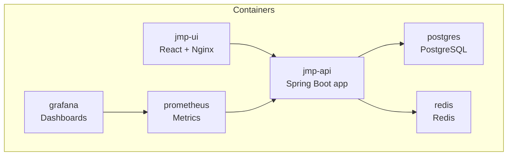
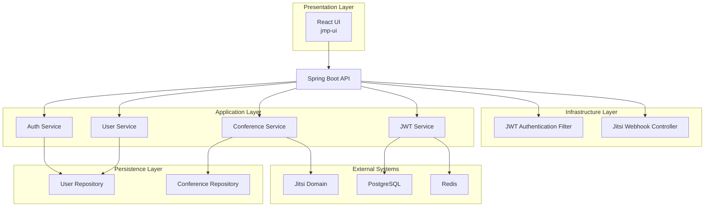

# Начало работы

<cite>
**Файлы, упоминаемые в этом документе**
- [docker-compose.yml](file://docker-compose.yml)
- [Dockerfile](file://Dockerfile)
- [pom.xml](file://pom.xml)
- [application.yml](file://jmp-web/src/main/resources/application.yml)
- [V1__init_schema.sql](file://jmp-web/src/main/resources/db/migration/V1__init_schema.sql)
- [V2__seed_data.sql](file://jmp-web/src/main/resources/db/migration/V2__seed_data.sql)
- [AuthController.java](file://jmp-api/src/main/java/com/jmp/api/controller/AuthController.java)
- [UserController.java](file://jmp-api/src/main/java/com/jmp/api/controller/UserController.java)
- [ConferenceController.java](file://jmp-api/src/main/java/com/jmp/api/controller/ConferenceController.java)
- [JwtService.java](file://jmp-application/src/main/java/com/jmp/application/service/JwtService.java)
- [JwtAuthenticationFilter.java](file://jmp-infrastructure/src/main/java/com/jmp/infrastructure/security/JwtAuthenticationFilter.java)
- [JitsiWebhookController.java](file://jmp-api/src/main/java/com/jmp/api/controller/JitsiWebhookController.java)
- [prometheus.yml](file://monitoring/prometheus.yml)
- [datasources.yml](file://monitoring/grafana/datasources/datasources.yml)
- [api.ts](file://jmp-ui/src/services/api.ts)
- [Dockerfile (UI)](file://jmp-ui/Dockerfile)
- [package.json (UI)](file://jmp-ui/package.json)
</cite>

## Содержание
1. [Введение](#введение)
2. [Структура проекта](#структура-проекта)
3. [Предварительные требования](#предварительные-требования)
4. [Установка](#установка)
5. [Начальная настройка](#начальная-настройка)
6. [Проверка первого запуска](#проверка-первого-запуска)
7. [Переменные окружения](#переменные-окружения)
8. [Инициализация базы данных](#инициализация-базы-данных)
9. [Базовое тестирование API](#базовое-тестирование-api)
10. [Примеры быстрого старта](#примеры-быстрого-старта)
11. [Обзор архитектуры](#обзор-архитектуры)
12. [Руководство по устранению неполадок](#руководство-по-устранению-неполадок)
13. [Заключение](#заключение)

## Введение
Данное руководство поможет вам быстро установить, настроить и проверить платформу управления Jitsi (JMP) с использованием Docker Compose. Оно охватывает предварительные требования, пошаговую установку, конфигурацию окружения, инициализацию базы данных и проверки при первом запуске. Вы также узнаете, как тестировать API для таких типовых задач, как регистрация пользователей, создание конференций и генерация токенов Jitsi для встреч.

## Структура проекта
Платформа состоит из:
- Сервиса Backend API (Spring Boot), предоставляющего REST-эндпоинты для аутентификации, управления пользователями, конференциями и вебхуками
- Фронтенда (React), обслуживаемого через Nginx в контейнере
- Вспомогательной инфраструктуры: PostgreSQL (база данных), Redis (кеш), Prometheus (метрики) и Grafana (дашборды)
- Набора мониторинга, интегрированного с эндпоинтами actuator бэкенда

**Источники диаграммы**
- [docker-compose.yml:6-129](file://docker-compose.yml#L6-L129)
- [Dockerfile:1-54](file://Dockerfile#L1-L54)
- [Dockerfile (UI):1-33](file://jmp-ui/Dockerfile#L1-L33)

**Источники раздела**
- [docker-compose.yml:1-129](file://docker-compose.yml#L1-L129)
- [Dockerfile:1-54](file://Dockerfile#L1-L54)
- [Dockerfile (UI):1-33](file://jmp-ui/Dockerfile#L1-L33)

## Предварительные требования
Убедитесь, что на вашей системе установлены следующие инструменты:
- Java 21+ (требуется для сборки и выполнения бэкенда)
- Docker и Docker Compose
- Node.js 20+ (для локальной разработки UI; опционально при использовании готового контейнера UI)

Эти версии определяются конфигурацией проекта:
- Java 21 требуется для сборки и запуска бэкенда
- Dockerfile собирает с Eclipse Temurin 21 JDK и запускает на JRE 21
- Dockerfile UI использует Node.js 20 для сборки React-приложения

**Источники раздела**
- [pom.xml:48-52](file://pom.xml#L48-L52)
- [Dockerfile:5-6](file://Dockerfile#L5-L6)
- [Dockerfile (UI):5-5](file://jmp-ui/Dockerfile#L5-L5)
- [package.json (UI):1-39](file://jmp-ui/package.json#L1-L39)

## Установка
Выполните следующие шаги для развёртывания платформы с помощью Docker Compose:

1. Клонируйте или скачайте репозиторий на свою машину.
2. Из корня репозитория запустите все сервисы:
   - Используйте предоставленный compose-файл для запуска контейнеров API, UI, базы данных, кеша и мониторинга.
3. Дождитесь, пока все сервисы перейдут в состояние healthy:
   - Эндпоинт здоровья API доступен по адресу /actuator/health
   - UI обслуживается на порту 5173 внутри контейнера (маппинг на порт 80 в контейнере)
   - База данных и кеш настроены с проверками здоровья

Шаги проверки:
- Подтвердите статус контейнеров: все сервисы должны быть healthy
- Откройте здоровье бэкенда: http://localhost:8080/actuator/health
- Откройте фронтенд: http://localhost:5173
- Откройте дашборды мониторинга:
  - Prometheus: http://localhost:9090
  - Grafana: http://localhost:3000 (пароль администратора по умолчанию задан в compose)

**Источники раздела**
- [docker-compose.yml:44-71](file://docker-compose.yml#L44-L71)
- [docker-compose.yml:74-86](file://docker-compose.yml#L74-L86)
- [docker-compose.yml:89-118](file://docker-compose.yml#L89-L118)

## Начальная настройка
Платформа использует переменные окружения и конфигурационные файлы для определения поведения во время выполнения. Ключевые области конфигурации:

- Конфигурация бэкенда (application.yml):
  - URL источника данных, имя пользователя, пароль и настройки пула HikariCP
  - Конфигурация и схема миграций Flyway
  - Настройки подключения к Redis
  - Секреты JWT и время их действия
  - Пути Actuator и OpenAPI/Swagger UI
  - Порт сервера и сжатие

- Переопределения окружения Compose:
  - URL базы данных, учётные данные и URL Redis
  - Секреты доступа и обновления JWT
  - Базовый URL API для UI

Важные значения по умолчанию:
- База данных: postgres:16-alpine, том смонтирован для постоянного хранения
- Кеш: redis:7-alpine, том смонтирован для постоянного хранения
- Бэкенд: порт 8080, проверка здоровья через /actuator/health
- UI: порт 80 внутри контейнера, маппинг на 5173 на хосте

**Источники раздела**
- [application.yml:12-67](file://jmp-web/src/main/resources/application.yml#L12-L67)
- [application.yml:72-78](file://jmp-web/src/main/resources/application.yml#L72-L78)
- [application.yml:93-128](file://jmp-web/src/main/resources/application.yml#L93-L128)
- [docker-compose.yml:49-56](file://docker-compose.yml#L49-L56)
- [docker-compose.yml:79-80](file://docker-compose.yml#L79-L80)

## Проверка первого запуска
После запуска сервисов проверьте установку:

1. Здоровье бэкенда:
   - Эндпоинт: http://localhost:8080/actuator/health
   - Должен вернуть статус здоровья после запуска

2. Swagger/OpenAPI:
   - UI: http://localhost:8080/swagger-ui.html
   - Документация API: http://localhost:8080/v3/api-docs

3. Фронтенд:
   - UI: http://localhost:5173
   - Должен загрузиться без ошибок

4. Мониторинг:
   - Prometheus: http://localhost:9090
   - Grafana: http://localhost:3000 (пароль администратора по умолчанию задан в compose)

5. База данных и кеш:
   - Проверки здоровья Postgres и Redis определены в compose

**Источники раздела**
- [docker-compose.yml:66-71](file://docker-compose.yml#L66-L71)
- [application.yml:114-128](file://jmp-web/src/main/resources/application.yml#L114-L128)
- [prometheus.yml:18-22](file://monitoring/prometheus.yml#L18-L22)
- [datasources.yml:4-10](file://monitoring/grafana/datasources/datasources.yml#L4-L10)

## Переменные окружения
Настройте платформу с помощью следующих переменных окружения. Они используются бэкендом и UI:

Бэкенд (из application.yml и compose):
- SPRING_PROFILES_ACTIVE: dev или prod
- DB_URL: JDBC URL для PostgreSQL
- DB_USER: Имя пользователя базы данных
- DB_PASS: Пароль базы данных
- REDIS_URL: Хост Redis
- JWT_ACCESS_SECRET: Секрет access-токенов в кодировке Base64
- JWT_REFRESH_SECRET: Секрет refresh-токенов в кодировке Base64
- SERVER_PORT: HTTP-порт бэкенда (по умолчанию 8080)
- VITE_API_URL: Базовый URL API для UI (по умолчанию http://localhost:8080/api/v1)

Специфичные для Compose:
- Сервисы определяют значения по умолчанию для DB_URL, DB_USER, DB_PASS, REDIS_URL, секретов JWT и URL API

Рекомендация:
- Для промышленной эксплуатации переопределите секреты и URL в защищённом окружении или в файле переопределения compose.

**Источники раздела**
- [application.yml:9-67](file://jmp-web/src/main/resources/application.yml#L9-L67)
- [application.yml:72-78](file://jmp-web/src/main/resources/application.yml#L72-L78)
- [docker-compose.yml:49-56](file://docker-compose.yml#L49-L56)
- [docker-compose.yml:79-80](file://docker-compose.yml#L79-L80)

## Инициализация базы данных
Платформа автоматически инициализирует схему базы данных и заполняет её данными по умолчанию:

- Миграции Flyway:
  - Включены и настроены на выполнение из classpath:db/migration
  - Схема: jmp
  - Включён baseline on migrate

- Начальная схема:
  - Создаёт схему jmp и расширение UUID
  - Определяет таблицы для тенантов, пользователей, ролей, разрешений, конференций и участников
  - Добавляет индексы и комментарии для производительности и наглядности

- Начальные данные:
  - Вставляет тенанта по умолчанию
  - Заполняет системные разрешения и роли
  - Создаёт пользователей admin и tenant admin с предопределёнными учётными данными

Файлы миграций:
- V1__init_schema.sql: создаёт схему и таблицы
- V2__seed_data.sql: вставляет тенанта по умолчанию, разрешения, роли и пользователей

Проверка:
- После первого запуска база данных должна содержать инициализированную схему и начальные данные.

**Источники раздела**
- [application.yml:39-43](file://jmp-web/src/main/resources/application.yml#L39-L43)
- [V1__init_schema.sql:1-172](file://jmp-web/src/main/resources/db/migration/V1__init_schema.sql#L1-L172)
- [V2__seed_data.sql:1-131](file://jmp-web/src/main/resources/db/migration/V2__seed_data.sql#L1-L131)

## Базовое тестирование API
Используйте следующие эндпоинты для тестирования основных функций. Замените заполнители на реальные значения и используйте клиент, например curl или Postman.

Аутентификация:
- POST /api/v1/auth/login
  - Тело: { "email": "<user-email>", "password": "<password>" }
  - При успехе: возвращает accessToken, refreshToken, expiresAt и профиль пользователя

- POST /api/v1/auth/refresh
  - Тело: { "refreshToken": "<your-refresh-token>" }
  - При успехе: возвращает новый accessToken и его время жизни

Пользователи:
- GET /api/v1/users/me
  - Возвращает профиль текущего пользователя

- POST /api/v1/users
  - Требует TENANT_ADMIN или SUPER_ADMIN
  - Тело: данные для создания пользователя

Конференции:
- POST /api/v1/conferences
  - Создаёт новую конференцию для аутентифицированного тенанта
  - Тело: данные для создания конференции

- POST /api/v1/conferences/{id}/start
  - Запускает существующую конференцию

- POST /api/v1/conferences/{id}/end
  - Завершает существующую конференцию

- POST /api/v1/conferences/{id}/token
  - Генерирует JWT-токен Jitsi для присоединения к конференции
  - Тело: { "displayName": "<display-name>", "isModerator": true/false }

Примечания:
- Заголовок Authorization: Bearer <accessToken>
- Клиент UI (api.ts) демонстрирует, как прикреплять токены и обновлять их при 401

**Источники раздела**
- [AuthController.java:42-100](file://jmp-api/src/main/java/com/jmp/api/controller/AuthController.java#L42-L100)
- [UserController.java:102-107](file://jmp-api/src/main/java/com/jmp/api/controller/UserController.java#L102-L107)
- [ConferenceController.java:49-138](file://jmp-api/src/main/java/com/jmp/api/controller/ConferenceController.java#L49-L138)
- [ConferenceController.java:140-173](file://jmp-api/src/main/java/com/jmp/api/controller/ConferenceController.java#L140-L173)
- [api.ts:60-92](file://jmp-ui/src/services/api.ts#L60-L92)

## Примеры быстрого старта
Ниже приведены практические сценарии, которые можно протестировать сразу после установки:

- Регистрация пользователя (от имени администратора тенанта):
  - Аутентифицируйтесь как TENANT_ADMIN или SUPER_ADMIN
  - Вызовите POST /api/v1/users с данными для создания пользователя
  - Убедитесь, что новый пользователь появился в GET /api/v1/users?page=0&size=10

- Создание конференции:
  - Аутентифицируйтесь как модератор или с более высокой ролью
  - Вызовите POST /api/v1/conferences с данными для создания конференции
  - При необходимости запустите/завершите конференцию с помощью POST /api/v1/conferences/{id}/start и POST /api/v1/conferences/{id}/end

- Управление записями:
  - Записи моделируются в схеме и управляются через соответствующие эндпоинты
  - Используйте эндпоинты, связанные с записями, для их просмотра, управления и удаления в соответствии с вашей ролью

- Генерация токена Jitsi:
  - Аутентифицируйтесь и вызовите POST /api/v1/conferences/{id}/token
  - Используйте возвращённый токен для присоединения к встрече через домен Jitsi тенанта

Примечание: UI интегрирован с этими эндпоинтами и автоматически обрабатывает обновление токенов.

**Источники раздела**
- [UserController.java:43-55](file://jmp-api/src/main/java/com/jmp/api/controller/UserController.java#L43-L55)
- [ConferenceController.java:49-63](file://jmp-api/src/main/java/com/jmp/api/controller/ConferenceController.java#L49-L63)
- [ConferenceController.java:118-130](file://jmp-api/src/main/java/com/jmp/api/controller/ConferenceController.java#L118-L130)
- [ConferenceController.java:140-173](file://jmp-api/src/main/java/com/jmp/api/controller/ConferenceController.java#L140-L173)
- [api.ts:78-92](file://jmp-ui/src/services/api.ts#L78-L92)

## Обзор архитектуры
Платформа следует многоуровневой архитектуре с чётким разделением ответственности:

**Источники диаграммы**
- [JwtAuthenticationFilter.java:27-76](file://jmp-infrastructure/src/main/java/com/jmp/infrastructure/security/JwtAuthenticationFilter.java#L27-L76)
- [JwtService.java:25-43](file://jmp-application/src/main/java/com/jmp/application/service/JwtService.java#L25-L43)
- [AuthController.java:30-41](file://jmp-api/src/main/java/com/jmp/api/controller/AuthController.java#L30-L41)
- [UserController.java:33-42](file://jmp-api/src/main/java/com/jmp/api/controller/UserController.java#L33-L42)
- [ConferenceController.java:37-47](file://jmp-api/src/main/java/com/jmp/api/controller/ConferenceController.java#L37-L47)
- [JitsiWebhookController.java:24-31](file://jmp-api/src/main/java/com/jmp/api/controller/JitsiWebhookController.java#L24-L31)

## Руководство по устранению неполадок
Типовые проблемы при настройке и их решения:

- Бэкенд не запускается или проверка здоровья не проходит:
  - Убедитесь, что PostgreSQL и Redis в состоянии healthy перед запуском API
  - Проверьте учётные данные и подключение к базе данных
  - Просмотрите логи бэкенда на наличие ошибок миграции Flyway или отсутствующих секретов

- UI не может подключиться к API:
  - Подтвердите корректность VITE_API_URL в контейнере UI
  - Убедитесь, что API доступен на порту 8080

- Ошибки аутентификации:
  - Проверьте, что секреты JWT правильно заданы
  - Убедитесь, что начальные пользователи существуют и пароли соответствуют ожиданиям

- Проблемы со схемой базы данных:
  - Подтвердите успешное выполнение миграций Flyway
  - Проверьте, что схема jmp существует и таблицы созданы

- Дашборды мониторинга не загружаются:
  - Убедитесь, что Prometheus собирает данные с эндпоинта API /actuator/prometheus
  - Подтвердите, что источник данных Grafana указывает на Prometheus

**Источники раздела**
- [docker-compose.yml:59-63](file://docker-compose.yml#L59-L63)
- [docker-compose.yml:66-71](file://docker-compose.yml#L66-L71)
- [application.yml:39-43](file://jmp-web/src/main/resources/application.yml#L39-L43)
- [prometheus.yml:18-22](file://monitoring/prometheus.yml#L18-L22)
- [datasources.yml:4-10](file://monitoring/grafana/datasources/datasources.yml#L4-L10)

## Заключение
Теперь у вас есть полностью функциональное развёртывание платформы управления Jitsi с использованием Docker Compose. Вы можете выполнять аутентификацию, управлять пользователями и конференциями, генерировать токены Jitsi и мониторить систему с помощью Prometheus и Grafana. Используйте предоставленные эндпоинты API и UI для дальнейшего изучения возможностей, а при возникновении типовых проблем обращайтесь к разделу устранения неполадок.
