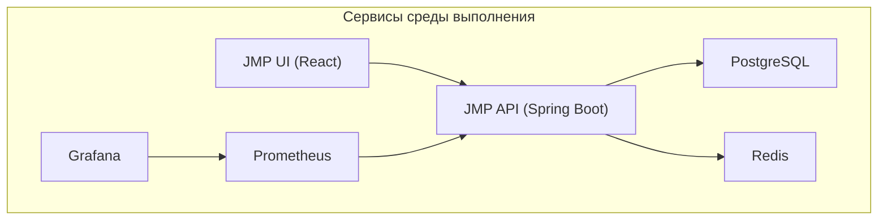
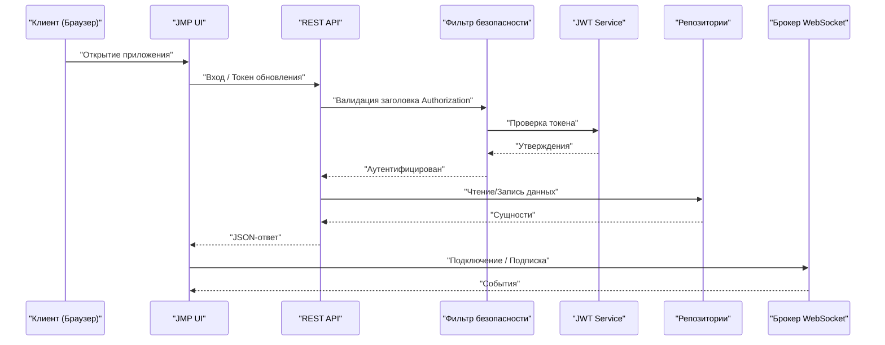
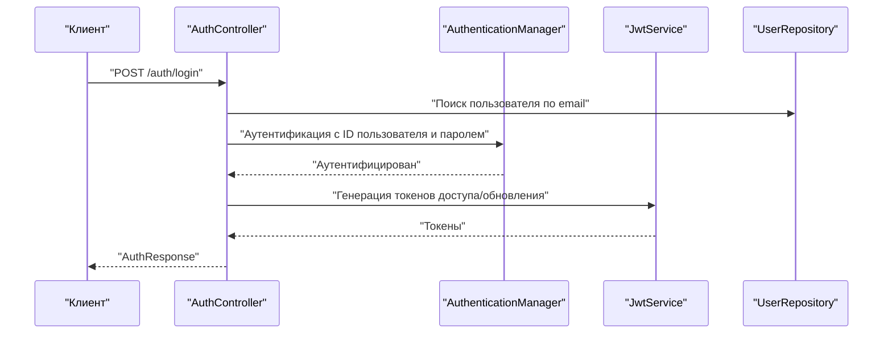
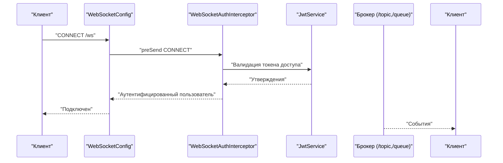
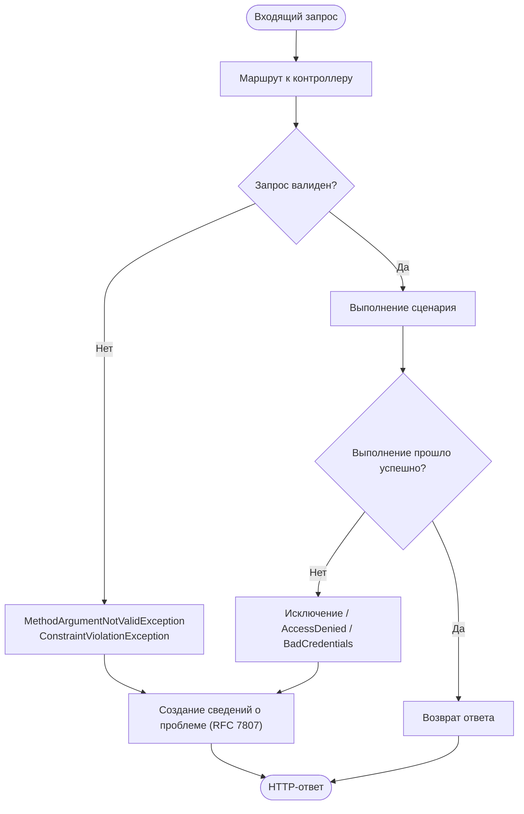
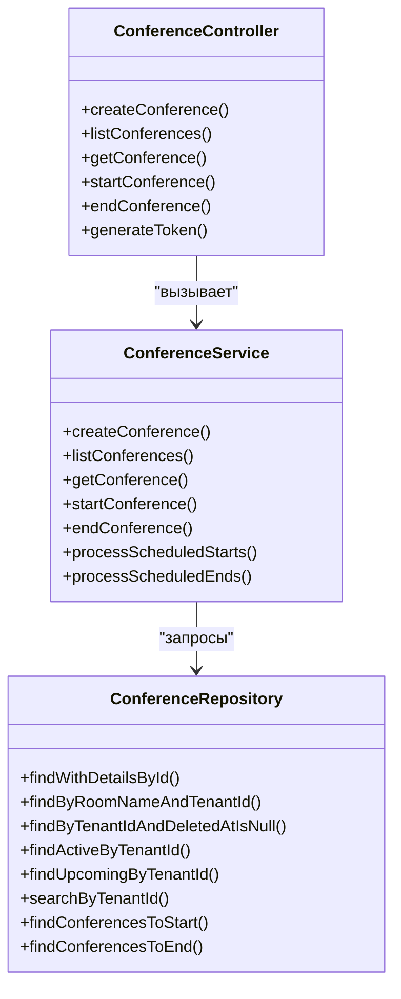
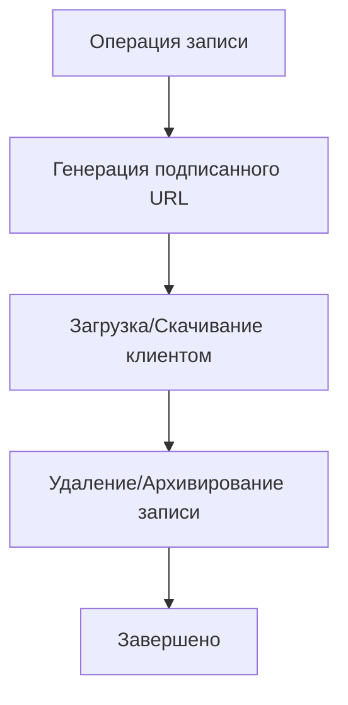
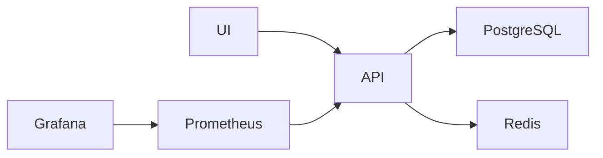

# Устранение неполадок и часто задаваемые вопросы

<cite>
**Файлы, упомянутые в этом документе**
- [application.yml](file://jmp-web/src/main/resources/application.yml)
- [docker-compose.yml](file://docker-compose.yml)
- [Dockerfile](file://Dockerfile)
- [GlobalExceptionHandler.java](file://jmp-api/src/main/java/com/jmp/api/advice/GlobalExceptionHandler.java)
- [SecurityConfig.java](file://jmp-infrastructure/src/main/java/com/jmp/infrastructure/security/SecurityConfig.java)
- [WebSocketConfig.java](file://jmp-infrastructure/src/main/java/com/jmp/infrastructure/websocket/WebSocketConfig.java)
- [WebSocketAuthInterceptor.java](file://jmp-infrastructure/src/main/java/com/jmp/infrastructure/websocket/WebSocketAuthInterceptor.java)
- [RealtimeEventService.java](file://jmp-infrastructure/src/main/java/com/jmp/infrastructure/websocket/RealtimeEventService.java)
- [S3StorageService.java](file://jmp-infrastructure/src/main/java/com/jmp/infrastructure/storage/S3StorageService.java)
- [AuthController.java](file://jmp-api/src/main/java/com/jmp/api/controller/AuthController.java)
- [ConferenceController.java](file://jmp-api/src/main/java/com/jmp/api/controller/ConferenceController.java)
- [ConferenceService.java](file://jmp-application/src/main/java/com/jmp/application/service/ConferenceService.java)
- [ConferenceRepository.java](file://jmp-domain/src/main/java/com/jmp/domain/repository/ConferenceRepository.java)
- [prometheus.yml](file://monitoring/prometheus.yml)
- [datasources.yml](file://monitoring/grafana/datasources/datasources.yml)
</cite>

## Содержание
1. [Введение](#введение)
2. [Структура проекта](#структура-проекта)
3. [Основные компоненты](#основные-компоненты)
4. [Обзор архитектуры](#обзор-архитектуры)
5. [Детальный анализ компонентов](#детальный-анализ-компонентов)
6. [Анализ зависимостей](#анализ-зависимостей)
7. [Вопросы производительности](#вопросы-производительности)
8. [Руководство по устранению неполадок](#руководство-по-устранению-неполадок)
9. [Часто задаваемые вопросы](#часто-задаваемые-вопросы)
10. [Заключение](#заключение)

## Введение
Этот документ содержит комплексное руководство по устранению неполадок и часто задаваемые вопросы для платформы управления Jitsi (JMP). Он охватывает операционную диагностику для подключения к базе данных, аутентификации, каналов WebSocket реального времени, ошибок API, производительности, развертываний, интеграций и отладки. Он также включает процедуры эскалации и ресурсы поддержки для сложных проблем.

## Структура проекта
Платформа представляет собой микросервис Spring Boot с:
- Веб/API-уровнем, предоставляющим REST-эндпоинты и документацию Swagger/OpenAPI
- Сервисами приложения, оркестрирующими логику домена
- Сущностями домена и репозиториями для постоянства
- Инфраструктурой для безопасности, обмена сообщениями WebSocket и хранения
- Стеком мониторинга (Prometheus и Grafana)
- Развертыванием на основе Docker с docker-compose

**Источники диаграммы**
- [docker-compose.yml:1-129](file://docker-compose.yml#L1-L129)
- [Dockerfile:1-54](file://Dockerfile#L1-L54)
- [application.yml:1-128](file://jmp-web/src/main/resources/application.yml#L1-L128)
- [prometheus.yml:1-23](file://monitoring/prometheus.yml#L1-L23)
- [datasources.yml:1-11](file://monitoring/grafana/datasources/datasources.yml#L1-L11)

**Источники раздела**
- [docker-compose.yml:1-129](file://docker-compose.yml#L1-L129)
- [Dockerfile:1-54](file://Dockerfile#L1-L54)
- [application.yml:1-128](file://jmp-web/src/main/resources/application.yml#L1-L128)

## Основные компоненты
- REST API с централизованной обработкой исключений, возвращающий стандартизированные сведения о проблемах
- Spring Security с аутентификацией stateless JWT и конфигурацией CORS
- Обмен сообщениями реального времени через WebSocket с STOMP через SockJS и аутентификацией на основе JWT
- Интеграция хранилища, совместимого с S3, для записей с предварительными подписанными URL
- Сервис управления конференциями с транзакционными операциями и запросами репозитория
- Мониторинг через экспорты Actuator Prometheus и дашборды Grafana

**Источники раздела**
- [GlobalExceptionHandler.java:1-130](file://jmp-api/src/main/java/com/jmp/api/advice/GlobalExceptionHandler.java#L1-L130)
- [SecurityConfig.java:1-90](file://jmp-infrastructure/src/main/java/com/jmp/infrastructure/security/SecurityConfig.java#L1-L90)
- [WebSocketConfig.java:1-70](file://jmp-infrastructure/src/main/java/com/jmp/infrastructure/websocket/WebSocketConfig.java#L1-L70)
- [WebSocketAuthInterceptor.java:1-94](file://jmp-infrastructure/src/main/java/com/jmp/infrastructure/websocket/WebSocketAuthInterceptor.java#L1-L94)
- [RealtimeEventService.java:1-142](file://jmp-infrastructure/src/main/java/com/jmp/infrastructure/websocket/RealtimeEventService.java#L1-L142)
- [S3StorageService.java:1-129](file://jmp-infrastructure/src/main/java/com/jmp/infrastructure/storage/S3StorageService.java#L1-L129)
- [ConferenceService.java:1-225](file://jmp-application/src/main/java/com/jmp/application/service/ConferenceService.java#L1-L225)
- [ConferenceRepository.java:1-110](file://jmp-domain/src/main/java/com/jmp/domain/repository/ConferenceRepository.java#L1-L110)

## Обзор архитектуры
Высокоуровневая архитектура среды выполнения и потоки данных/управления:

**Источники диаграммы**
- [AuthController.java:1-124](file://jmp-api/src/main/java/com/jmp/api/controller/AuthController.java#L1-L124)
- [SecurityConfig.java:1-90](file://jmp-infrastructure/src/main/java/com/jmp/infrastructure/security/SecurityConfig.java#L1-L90)
- [WebSocketConfig.java:1-70](file://jmp-infrastructure/src/main/java/com/jmp/infrastructure/websocket/WebSocketConfig.java#L1-L70)
- [WebSocketAuthInterceptor.java:1-94](file://jmp-infrastructure/src/main/java/com/jmp/infrastructure/websocket/WebSocketAuthInterceptor.java#L1-L94)
- [ConferenceRepository.java:1-110](file://jmp-domain/src/main/java/com/jmp/domain/repository/ConferenceRepository.java#L1-L110)

## Детальный анализ компонентов

### Аутентификация и авторизация
Типичные симптомы:
- Вход не выполняется с недействительными учетными данными
- Отказ в доступе после успешного входа
- Ошибки обновления токена

Шаги диагностики:
- Проверьте секреты JWT и настройки времени жизни
- Подтвердите конфигурацию менеджера аутентификации и кодировщика паролей
- Проверьте источники CORS и политику учетных данных
- Просмотрите логи на предмет BadCredentialsException и AccessDeniedException

**Источники диаграммы**
- [AuthController.java:1-124](file://jmp-api/src/main/java/com/jmp/api/controller/AuthController.java#L1-L124)
- [SecurityConfig.java:1-90](file://jmp-infrastructure/src/main/java/com/jmp/infrastructure/security/SecurityConfig.java#L1-L90)

**Источники раздела**
- [AuthController.java:1-124](file://jmp-api/src/main/java/com/jmp/api/controller/AuthController.java#L1-L124)
- [SecurityConfig.java:1-90](file://jmp-infrastructure/src/main/java/com/jmp/infrastructure/security/SecurityConfig.java#L1-L90)
- [GlobalExceptionHandler.java:1-130](file://jmp-api/src/main/java/com/jmp/api/advice/GlobalExceptionHandler.java#L1-L130)

### События реального времени через WebSocket
Типичные симптомы:
- Клиенты не могут подключиться к эндпоинту WebSocket
- Подписки не получают события
- Ошибки аутентификации в CONNECT WebSocket

Шаги диагностики:
- Проверьте регистрацию эндпоинта STOMP и разрешенные источники
- Подтвердите извлечение JWT из заголовка Authorization или SockJS login
- Проверьте назначения брокера и конвертеры сообщений
- Проверьте логирование ошибок RealtimeEventService на предмет ошибок отправки

**Источники диаграммы**
- [WebSocketConfig.java:1-70](file://jmp-infrastructure/src/main/java/com/jmp/infrastructure/websocket/WebSocketConfig.java#L1-L70)
- [WebSocketAuthInterceptor.java:1-94](file://jmp-infrastructure/src/main/java/com/jmp/infrastructure/websocket/WebSocketAuthInterceptor.java#L1-L94)
- [RealtimeEventService.java:1-142](file://jmp-infrastructure/src/main/java/com/jmp/infrastructure/websocket/RealtimeEventService.java#L1-L142)

**Источники раздела**
- [WebSocketConfig.java:1-70](file://jmp-infrastructure/src/main/java/com/jmp/infrastructure/websocket/WebSocketConfig.java#L1-L70)
- [WebSocketAuthInterceptor.java:1-94](file://jmp-infrastructure/src/main/java/com/jmp/infrastructure/websocket/WebSocketAuthInterceptor.java#L1-L94)
- [RealtimeEventService.java:1-142](file://jmp-infrastructure/src/main/java/com/jmp/infrastructure/websocket/RealtimeEventService.java#L1-L142)

### Обработка ошибок и логирование API
- GlobalExceptionHandler возвращает сведения о проблемах RFC 7807 со структурированными метаданными ошибок
- Логи включают идентификаторы трассировки и метки времени для корреляции
- Ошибки валидации возвращают детали по полям

**Источники диаграммы**
- [GlobalExceptionHandler.java:1-130](file://jmp-api/src/main/java/com/jmp/api/advice/GlobalExceptionHandler.java#L1-L130)
- [application.yml:80-128](file://jmp-web/src/main/resources/application.yml#L80-L128)

**Источники раздела**
- [GlobalExceptionHandler.java:1-130](file://jmp-api/src/main/java/com/jmp/api/advice/GlobalExceptionHandler.java#L1-L130)
- [application.yml:80-128](file://jmp-web/src/main/resources/application.yml#L80-L128)

### Управление конференциями и уровень данных
- Операции с конференциями транзакционные со строгими переходами состояний
- Запросы репозитория используют EntityGraphs и JPQL для производительности
- Автоматическое планирование запуска/завершения работает на уровне сервиса

**Источники диаграммы**
- [ConferenceController.java:1-189](file://jmp-api/src/main/java/com/jmp/api/controller/ConferenceController.java#L1-L189)
- [ConferenceService.java:1-225](file://jmp-application/src/main/java/com/jmp/application/service/ConferenceService.java#L1-L225)
- [ConferenceRepository.java:1-110](file://jmp-domain/src/main/java/com/jmp/domain/repository/ConferenceRepository.java#L1-L110)

**Источники раздела**
- [ConferenceController.java:1-189](file://jmp-api/src/main/java/com/jmp/api/controller/ConferenceController.java#L1-L189)
- [ConferenceService.java:1-225](file://jmp-application/src/main/java/com/jmp/application/service/ConferenceService.java#L1-L225)
- [ConferenceRepository.java:1-110](file://jmp-domain/src/main/java/com/jmp/domain/repository/ConferenceRepository.java#L1-L110)

### Интеграция хранилища (совместимое с S3)
- Предварительно подписанные URL для загрузки/скачивания
- Опциональное переопределение эндпоинта для MinIO или совместимых сервисов
- Плейсхолдеры для удаления и архивирования

**Источники диаграммы**
- [S3StorageService.java:1-129](file://jmp-infrastructure/src/main/java/com/jmp/infrastructure/storage/S3StorageService.java#L1-L129)

**Источники раздела**
- [S3StorageService.java:1-129](file://jmp-infrastructure/src/main/java/com/jmp/infrastructure/storage/S3StorageService.java#L1-L129)

## Анализ зависимостей
Зависимости среды выполнения и проверки работоспособности:
- API зависит от PostgreSQL и Redis
- UI зависит от API
- Prometheus собирает метрики API
- Grafana потребляет данные Prometheus

**Источники диаграммы**
- [docker-compose.yml:1-129](file://docker-compose.yml#L1-L129)
- [prometheus.yml:1-23](file://monitoring/prometheus.yml#L1-L23)
- [datasources.yml:1-11](file://monitoring/grafana/datasources/datasources.yml#L1-L11)

**Источники раздела**
- [docker-compose.yml:1-129](file://docker-compose.yml#L1-L129)
- [prometheus.yml:1-23](file://monitoring/prometheus.yml#L1-L23)
- [datasources.yml:1-11](file://monitoring/grafana/datasources/datasources.yml#L1-L11)

## Вопросы производительности
- Пул подключений к базе данных и таймауты: настройте максимальный размер пула и таймауты подключений
- Пакетная обработка SQL и упорядочивание: настройки Hibernate batch уменьшают накладные расходы
- Открытая сессия при просмотре отключена: избегайте длительных транзакций
- Метрики и трассировка: включите структурированное логирование и экспорты Prometheus
- Кэширование: Redis настроен для кэширования сессий/состояния
- Сжатие: Gzip включен для ответов JSON

Рекомендации:
- Мониторьте медленные SQL через логи базы данных и статистику JDBC
- Масштабируйте Redis и PostgreSQL независимо в зависимости от нагрузки
- Используйте постраничные и индексированные запросы для больших наборов данных
- Профилируйте кучу и GC с помощью метрик JVM, предоставляемых Prometheus/Grafana

**Источники раздела**
- [application.yml:12-56](file://jmp-web/src/main/resources/application.yml#L12-L56)
- [application.yml:24-38](file://jmp-web/src/main/resources/application.yml#L24-L38)
- [application.yml:63-70](file://jmp-web/src/main/resources/application.yml#L63-L70)
- [application.yml:92-112](file://jmp-web/src/main/resources/application.yml#L92-L112)

## Руководство по устранению неполадок

### Проблемы подключения к базе данных
Симптомы:
- Запуск приложения завершается отказом в подключении
- Запросы завершаются таймаутом или работают с перебоями
- Ошибки миграции Flyway

Контрольный список:
- Подтвердите работоспособность и учетные данные контейнера PostgreSQL
- Проверьте переменные окружения URL, пользователя и пароля БД
- Убедитесь, что миграции применены (Flyway включен)
- Просмотрите настройки пула HikariCP и таймауты

Действия:
- Используйте проверки работоспособности docker-compose для подтверждения готовности БД
- Увеличьте таймаут подключения и размер пула при необходимости
- Проверьте сетевое подключение внутри контейнеров

**Источники раздела**
- [docker-compose.yml:8-25](file://docker-compose.yml#L8-L25)
- [application.yml:12-23](file://jmp-web/src/main/resources/application.yml#L12-L23)
- [application.yml:39-44](file://jmp-web/src/main/resources/application.yml#L39-L44)

### Ошибки аутентификации
Симптомы:
- 401 Unauthorized на защищенных эндпоинтах
- 403 Forbidden из-за недостаточных ролей
- Ошибки обновления токена

Контрольный список:
- Убедитесь, что секреты доступа/обновления JWT совпадают между сервисами
- Подтвердите коэффициент стоимости и алгоритм кодировщика паролей
- Проверьте разрешенные источники CORS и флаг учетных данных
- Просмотрите логи на предмет BadCredentialsException и AccessDeniedException

Действия:
- Перевыпустите токены с правильными секретами
- Согласуйте хранение токенов и заголовки на стороне клиента
- Проверьте утверждения ролей в JWT

**Источники раздела**
- [application.yml:72-79](file://jmp-web/src/main/resources/application.yml#L72-L79)
- [SecurityConfig.java:64-88](file://jmp-infrastructure/src/main/java/com/jmp/infrastructure/security/SecurityConfig.java#L64-L88)
- [GlobalExceptionHandler.java:54-80](file://jmp-api/src/main/java/com/jmp/api/advice/GlobalExceptionHandler.java#L54-L80)

### Проблемы с подключением WebSocket
Симптомы:
- Подключение завершается неудачей немедленно
- Подписки не получают события
- Ошибки аутентификации во время CONNECT

Контрольный список:
- Подтвердите регистрацию эндпоинта STOMP и разрешенные шаблоны источников
- Проверьте наличие JWT в заголовке Authorization или параметре login SockJS
- Убедитесь, что назначения брокера и конвертеры сообщений настроены
- Проверьте логи ошибок RealtimeEventService на предмет ошибок отправки

Действия:
- Протестируйте с нативным WebSocket и резервным вариантом SockJS
- Убедитесь, что атрибуты tenant/session установлены после аутентификации
- Проверьте емкость брокера и ограничения в памяти

**Источники раздела**
- [WebSocketConfig.java:42-50](file://jmp-infrastructure/src/main/java/com/jmp/infrastructure/websocket/WebSocketConfig.java#L42-L50)
- [WebSocketAuthInterceptor.java:33-73](file://jmp-infrastructure/src/main/java/com/jmp/infrastructure/websocket/WebSocketAuthInterceptor.java#L33-L73)
- [RealtimeEventService.java:88-101](file://jmp-infrastructure/src/main/java/com/jmp/infrastructure/websocket/RealtimeEventService.java#L88-L101)

### Ошибки API и исключения
Симптомы:
- Неожиданная ошибка 500 Internal Server Error
- Ошибки валидации с деталями по полям
- Отказ в доступе или несанкционированные ответы

Контрольный список:
- Просмотрите структурированные логи с идентификаторами трассировки
- Проверьте ответы со сведениями о проблемах на коды ошибок
- Проверьте полезные нагрузки запросов на соответствие ограничениям DTO

Действия:
- Коррелируйте логи с использованием trace_id
- Исправьте ограничения валидации или форму запроса
- Настройте разрешения или роли

**Источники раздела**
- [GlobalExceptionHandler.java:26-128](file://jmp-api/src/main/java/com/jmp/api/advice/GlobalExceptionHandler.java#L26-L128)
- [application.yml:80-91](file://jmp-web/src/main/resources/application.yml#L80-L91)

### Устранение неполадок производительности
Симптомы:
- Медленные запросы на перечисление/поиск конференций
- Давление на память или скачки GC
- Узкие места масштабируемости под нагрузкой

Контрольный список:
- Изучите метрики Prometheus на предмет задержки и пропускной способности
- Просмотрите планы выполнения запросов БД и индексы
- Мониторьте утилизацию ресурсов Redis и PostgreSQL
- Проверьте настройки пакетной обработки и упорядочивания

Действия:
- Добавьте недостающие индексы для частых фильтров
- Настройте параметры HikariCP и Hibernate
- Масштабируйте горизонтально с несколькими экземплярами API
- Используйте реплики только для чтения для отчетных запросов

**Источники раздела**
- [prometheus.yml:18-22](file://monitoring/prometheus.yml#L18-L22)
- [ConferenceRepository.java:48-72](file://jmp-domain/src/main/java/com/jmp/domain/repository/ConferenceRepository.java#L48-L72)
- [application.yml:24-38](file://jmp-web/src/main/resources/application.yml#L24-L38)

### Устранение неполадок развертывания
Симптомы:
- Контейнер не проходит проверки работоспособности
- Конфликты портов или неправильная конфигурация
- Зависимости сервисов не готовы

Контрольный список:
- Проверьте проверки работоспособности docker-compose для БД и Redis
- Подтвердите переменные окружения для URL БД и Redis
- Убедитесь, что API ожидает зависимости перед запуском
- Проверьте изоляцию сети и монтирование томов

Действия:
- Запустите docker-compose up с подробными логами
- Настройте пороги проверки работоспособности и периоды запуска
- Проверьте ENTRYPOINT и EXPOSE в Dockerfile

**Источники раздела**
- [docker-compose.yml:59-71](file://docker-compose.yml#L59-L71)
- [Dockerfile:47-51](file://Dockerfile#L47-L51)
- [application.yml:45-50](file://jmp-web/src/main/resources/application.yml#L45-L50)

### Устранение неполадок интеграции
Симптомы:
- Ошибка генерации URL с предварительной подписью S3
- Удаление или архивирование записи не работает
- Проблемы с подключением к серверу Jitsi

Контрольный список:
- Проверьте бакет S3, регион и учетные данные
- Подтвердите переопределение эндпоинта для сервисов, совместимых с MinIO
- Протестируйте срок действия и разрешения URL с предварительной подписью
- Проверьте домен Jitsi и генерацию токенов JWT

Действия:
- Сгенерируйте кратковременные URL с предварительной подписью для тестирования
- Используйте AWS CLI или браузер S3 для проверки доступа к бакету
- Проверьте разрешение домена Jitsi и TLS

**Источники раздела**
- [S3StorageService.java:32-59](file://jmp-infrastructure/src/main/java/com/jmp/infrastructure/storage/S3StorageService.java#L32-L59)
- [ConferenceController.java:140-173](file://jmp-api/src/main/java/com/jmp/api/controller/ConferenceController.java#L140-L173)

### Руководства по отладке
Фронтенд:
- Проверьте вкладку сети браузера на предмет неудачных запросов
- Убедитесь в правильности базового URL API и заголовков CORS
- Проверьте локальное хранилище на предмет токенов

Backend:
- Включите отладочное логирование для com.jmp и Spring Security
- Используйте curl или Postman для воспроизведения проблем
- Проверьте эндпоинты Actuator на работоспособность и метрики

Реальное время:
- Подключитесь с клиентом WebSocket (wscat или инструменты разработчика браузера)
- Проверьте кадры STOMP и подписки
- Подтвердите распространение JWT в заголовках CONNECT

**Источники раздела**
- [application.yml:80-91](file://jmp-web/src/main/resources/application.yml#L80-L91)
- [WebSocketConfig.java:42-50](file://jmp-infrastructure/src/main/java/com/jmp/infrastructure/websocket/WebSocketConfig.java#L42-L50)

## Часто задаваемые вопросы

В1: Каковы системные требования?
- Среда выполнения Java 21
- Docker и docker-compose для контейнеризированного развертывания
- PostgreSQL 16 и Redis 7 для зависимостей
- Минимальная ОЗУ/ЦП масштабируется с ожидаемой конкурентностью

В2: Как настроить секреты JWT?
- Установите секреты токенов доступа и обновления через переменные окружения
- Поддерживайте согласованность секретов между сервисами

В3: Как включить структурированное логирование?
- Формат логирования консоли - JSON; настройте уровни по мере необходимости

В4: Как передать метрики в Prometheus?
- Эндпоинт Actuator Prometheus включен; Prometheus собирает данные с /actuator/prometheus

В5: Как масштабировать систему?
- Масштабируйте API горизонтально; разделяйте масштабирование БД и Redis в зависимости от нагрузки
- Используйте несколько реплик API за обратным прокси

В6: Как интегрироваться с хранилищем, совместимым с S3?
- Предоставьте бакет, регион и учетные данные; при необходимости установите эндпоинт для MinIO

В7: Как устранить неполадки медленных запросов конференций?
- Используйте постраничные эндпоинты и фильтры поиска
- Убедитесь в правильном индексировании полей арендатора и статуса

В8: Как исправить проблемы с CORS?
- Добавьте в белый список источники для портов UI и включите учетные данные

В9: Как проверить подключения WebSocket?
- Протестируйте как нативный WebSocket, так и резервный вариант SockJS
- Убедитесь, что заголовок Authorization содержит действительный токен Bearer

В10: Как эскалировать сложные проблемы?
- Соберите логи с идентификаторами трассировки, полезными нагрузками запросов/ответов и снимками метрик
- Откройте тикет с информацией об окружении и шагами воспроизведения

**Источники раздела**
- [application.yml:72-128](file://jmp-web/src/main/resources/application.yml#L72-L128)
- [docker-compose.yml:1-129](file://docker-compose.yml#L1-L129)
- [prometheus.yml:18-22](file://monitoring/prometheus.yml#L18-L22)

## Заключение
Это руководство объединяет практические шаги по устранению неполадок, методы диагностики и часто задаваемые вопросы для платформы управления Jitsi. Используя структурированное логирование, стандартизированные ответы об ошибках, проверки работоспособности и стек мониторинга, большинство проблем можно быстро выявить и решить. Для постоянных или сложных проблем соберите комплексные логи и метрики и следуйте процедурам эскалации, описанным выше.
